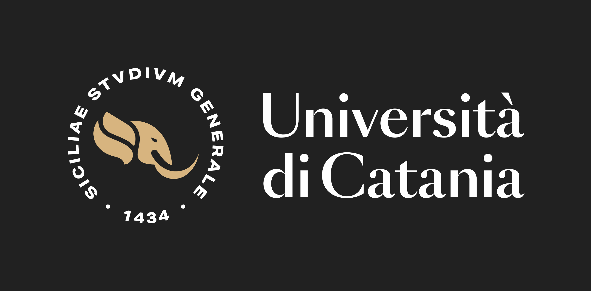

<div align="center">
<h3>IPLAB reading group</i></h3>
<h1>Denoising Diffusion Probabilistic Models</h1>
</div>

## Seminar details

* Location: `IPLAB`
* Presenter: `Lemuel Puglisi` ([website](https://lemuelpuglisi.github.io))
* Date: `20/11/2023`

## Presentation instructions

Clone the repository and install `slidev` dependencies
```bash
npm install
```

Run the presentation 
``` bash
npm run dev
```

Or export to PDF
```
slidev export --dark
```